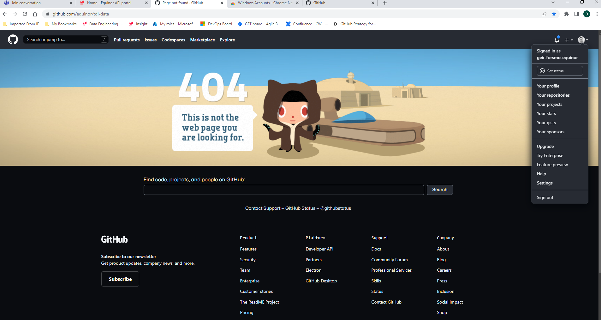

# TDI Data Office AutoMail Solution

This repository holds the entire project file for the TDI Data Office AutoMail solution, the documentations and (to be developed) the GitHub actions for committing changes and deployment.

## Solution Overview
This solution is developed to enable TDI Data Office Information Management staff to be able to send out e-mails to Sharepoint site managers to alert them about actions to take regarding their sites. Click Here! to access the application.

## Solution Justification

The solution eliminate the use of manual approach to send out hundreds of seperate e-mails to the site managers using the Power Platform Canvas App created.

## Solution Taxonomy

Below are the listed order through which this solution was developed, after which each element of the deployment will be documented accordingly.

1. Business requirement documentation evaluation
   - Problem review
   - Use case discovery
   - Design consepualization
   - ...
2. Solution Design
   - Data Modelling
   - Security Modelling
3. Project Management and Governance

# Design Approach

The proejct design model followed the UI-UX...

## Design View
---
_see image below for design view_

## Resources
https://www.youtube.com/watch?v=FVGh8kDdaCA&t=3691s - Documenting Power Platform Projects on GitHub
